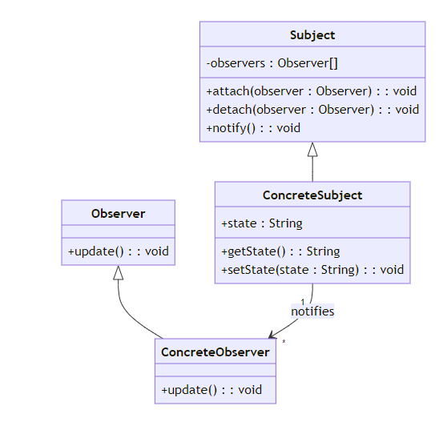

# Observer pattern

### Khái niệm

- Sử dụng dể tạo một cơ chế quản lý mối quan hệ một-nhiều và nhiều-nhiều giữa các đối tượng, sao cho khi trạng thái của một đối tượng thay đổi, tất cả đối tượng phụ thuộc (observers) sẽ được thông báo và cập nhật
- Observer Pattern thường được sử dụng để triển khai các hệ thống phản hồi sự kiện, trong đó đối tượng có thể gửi thông báo tới các đối tượng khác mà không cần biết rõ về những đối tượng đang lắng nghe

### Đặt vấn đề

Trong hệ thống phần mềm, việc theo dõi và phản ứng với các thay đổi trạng thái là một thách thức phổ biến

### Giải pháp

Observer Pattern giải quyết vấn đề trên bằng cách tạo ra một cơ chế “đăng ký - thông báo”. Trong hệ thống, các thành phần có thể “đăng ký” để theo dõi trạng thái của một đối tượng. Khi có thay đổi trạng thái, đối tượng này sẽ tự động “thông báo” cho tất cả các thành phần đã đăng ký

### **Cấu trúc**



Các thành phần trong Observer Pattern:

- Subject: đối tượng chủ thể cần theo dõi. Nó duy trì danh sách các Observer và thông báo cho chúng khi trạng thái thay đổi.
- Observer: đối tượng quan sát Subject. Nó đăng ký theo dõi Subject và cập nhật khi nhận được thông báo từ Subject.
- ConcreteSubject và ConcreteObserver: các cài đặt cụ thể.

### **Khi nào nên sử dụng Observer Pattern**

- **Khi bạn muốn một cơ chế thông báo tự động giữa các đối tượng**: Observer Pattern rất hữu ích khi bạn cần một hoặc nhiều đối tượng nhận thông báo tự động khi trạng thái của một đối tượng khác thay đổi. Điều này giúp đảm bảo tính nhất quán giữa các đối tượng liên quan mà không cần chúng trực tiếp gọi lẫn nhau.
- **Khi bạn muốn tạo ra các hệ thống linh hoạt có khả năng mở rộng cao**: Với Observer Pattern, bạn có thể dễ dàng thêm hoặc loại bỏ các observer mà không cần sửa đổi đối tượng chủ đề (subject) - đối tượng mà observer đăng ký theo dõi. Điều này giúp hệ thống của bạn dễ dàng mở rộng và thích ứng với nhu cầu thay đổi.
- **Trong các ứng dụng cần theo dõi và phản ứng với các sự kiện**: Observer Pattern là lựa chọn tối ưu cho các ứng dụng cần phản ứng nhanh chóng với các thay đổi, ví dụ như các hệ thống giám sát, ứng dụng thời tiết, hoặc bất kỳ ứng dụng nào mà dữ liệu cần được cập nhật theo thời gian thực.
- **Khi cần giảm sự phụ thuộc lẫn nhau giữa các thành phần**: Observer Pattern cho phép các thành phần hoạt động một cách độc lập, giảm bớt sự phụ thuộc trực tiếp. Các đối tượng observer không cần biết về sự tồn tại của các đối tượng khác, chỉ cần biết về đối tượng chủ đề mà chúng quan sát.
- **Trong việc xây dựng các ứng dụng phản ứng với sự kiện**: Các ứng dụng như bảng điều khiển quản lý, hệ thống cảnh báo, hoặc ứng dụng tài chính cần cập nhật giao diện người dùng dựa trên sự thay đổi của dữ liệu nền tảng. Observer Pattern giúp việc này trở nên mượt mà và hiệu quả, bằng cách thông báo cho giao diện người dùng (hoặc bất kỳ hệ thống phụ thuộc nào khác) mỗi khi có sự thay đổi dữ liệu.

## Cách triển khai

### **1. Subject Interface**

```java
public interface Subject {
    void attach(Observer o);
    void detach(Observer o);
    void notifyUpdate(Message m);
}
```

### **2. Observer Interface**

```java
public interface Observer {
    void update(Message m);
}
```

### **3. Concrete Subject**

```java
import java.util.ArrayList;
import java.util.List;

public class ConcreteSubject implements Subject {
    private List<Observer> observers = new ArrayList<>();

    @Override
    public void attach(Observer o) {
        observers.add(o);
    }

    @Override
    public void detach(Observer o) {
        observers.remove(o);
    }

    @Override
    public void notifyUpdate(Message m) {
        for(Observer o: observers) {
            o.update(m);
        }
    }
}
```

### **4. Concrete Observer**

```java
public class ConcreteObserver implements Observer {
    private String name;

    public ConcreteObserver(String name) {
        this.name = name;
    }

    @Override
    public void update(Message m) {
        System.out.println(name + " received message: " + m.getMessageContent());
    }
}
```

### **5. Message Class**

```java
public class Message {
    private String messageContent;

    public Message(String m) {
        this.messageContent = m;
    }

    public String getMessageContent() {
        return messageContent;
    }
}
```

### **6. Sử dụng Pattern**

```java
public class ObserverPatternDemo {
    public static void main(String[] args) {
        ConcreteSubject subject = new ConcreteSubject();

        Observer observer1 = new ConcreteObserver("Observer 1");
        Observer observer2 = new ConcreteObserver("Observer 2");

        subject.attach(observer1);
        subject.attach(observer2);

        subject.notifyUpdate(new Message("First Message")); // Cả hai observer sẽ nhận được thông báo
    }
}
```

# Một số biến thể khác của Observer Pattern

### Framework aspect

- Logging notify

### Microservice aspect

Pub-sub modal