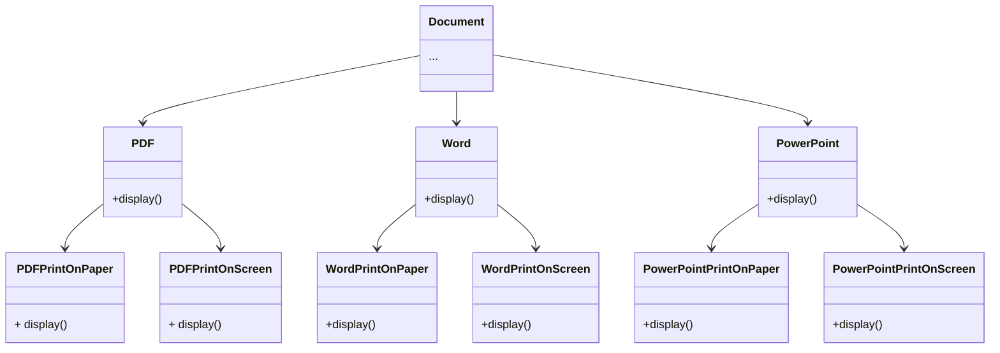
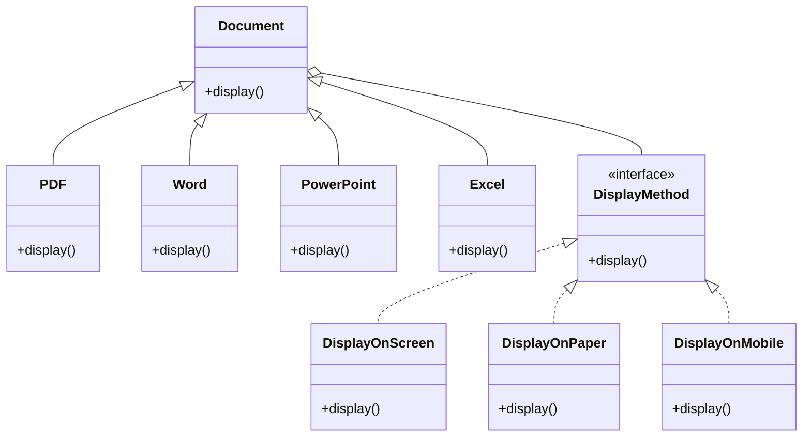

# Bridge Pattern
Là pattern thuộc kiểu Structural Pattern, cho phép chia một lớp lớn hoặc một tập hợp các lớp có liên quan chặt chẽ thành hai hệ thống phân cấp riêng biệt (Abstraction và Implementation). Chúng có thể được phát triển độc lập với nhau và không gây ảnh hưởng đến nhau.

1. **Đặt vấn đề**
    - Giả sử bạn đang xây dựng một hệ thống quản lý tài liệu. Bạn có các loại tài liệu như PDF, Word, PowerPoint và các hình thức hiển thị khác nhau như hiển thị trên trình duyệt, in ra giấy.\
    - Cách thông thường ta sẽ làm như sơ đồ sau:

- Giờ ta có yêu cầu là thêm tài loại liệu dạng Excel và cần hiển thị các tài liệu trên thiết bị di động. Khi này ta sẽ phải tạo rất nhiều class,điều này tạo ra một hệ thống cồng kềnh và khó bảo trì.để xử lý

2. **Cách giải quyết**
    - Ta thấy tài liệu và cách hiển thị rất phụ thuộc với nhau, vậy ta sẽ chia thành 2 phần tách biệt là tài liệu (Abstraction) và cách hiển thị (Implementation). Điều này sẽ giúp mở rộng rất linh hoạt. Và cách hoạt động như sơ đồ sau:

3. **Mục đích**
    - Tách rời phần giao diện (abstraction) và phần triển khai (implementation), giúp hai phần này có thể phát triển độc lập với nhau. Điều này giúp hệ thống dễ mở rộng, linh hoạt và dễ bảo trì hơn khi các tính năng hoặc cách thức thực thi mới được bổ sung.

4. **Nên sử dụng khi nào?**
    - Khi cần tách abstraction và implementation để phát triển độc lập.
    - Tránh việc tạo quá nhiều lớp con cho mỗi kết hợp giữa abstraction và implementation.
    - Hệ thống có khả năng mở rộng và bạn muốn dễ dàng thêm tính năng mới mà không làm phức tạp cấu trúc.

5. **Cấu trúc**
    - Abstraction: thường là abtract class hoặc interface để định nghĩa các phương thức của class
    - Refined Abstraction: Đây là lớp con của Abstraction, lớp này mở rộng lớp Abstraction và có thể bổ sung thêm các phương thức hoặc tính năng cụ thể.
    - Implementor: Là interface (hoặc lớp trừu tượng) định nghĩa các phương thức mà Abstraction sẽ sử dụng để thực hiện chức năng.
    - Concrete Implementor: Thực hiện các phương thức được định nghĩa trong Implementor.